## What is Ray Tracing

In order to define the ray tracing, we need to define what is 'Ray'.
The `Ray` is defined by two things, it has origin in some point in space (xyz) and a direction.

  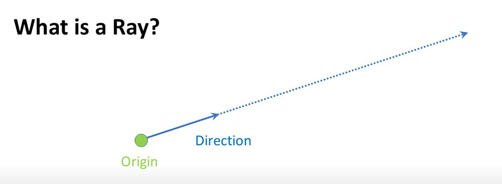

`Ray Casting` is taking the idea of taking that ray and shooting it out in that direction and finding
what gets hit.

  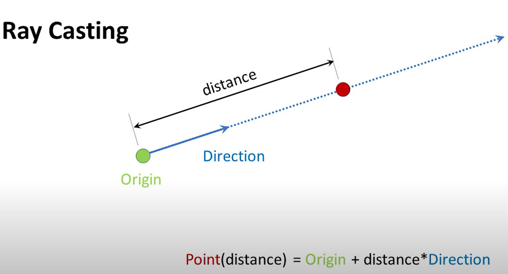

This isn't the rendering algorithm. This is just the a bsic tool in the toolbox. You can also use `ray casting` between two points so you may say.

  

  

### Human Eye Perspective

  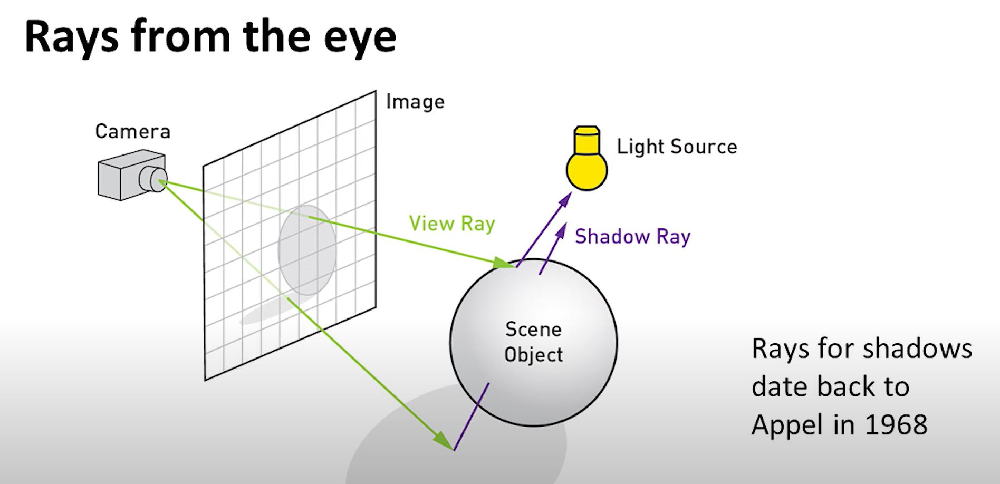

### Distribution(Stochastic) Ray Tracing
- Allow shadow rays to go to a random point on area light
- Allow specular rays to be perturbed specularly around the ideal reflection.
- Shoot sometime during the frame for motion blur

Instead of shooting just a single reflection ray, you're shooting a bunch or instead of shotting one shadow ray, you're shooting a bunch to try to get
a soft shadow.

### Kajiya-Style Diffuse Interreflection -> The Rendering Equation
- Path tracing: shoot each ray and follow it along a series of interreflections.

What if we say the sky is the limit, we're just going to shoot rays out from the eye and we're going to have each ray hit something.
we don't necessarily know which way it's going to reflect. If it's a mirror we know sure it'll reflect in the mirror direction.
But say it's something like unglazed pottery, then you don't know which way the lights are coming from. all kinds of different directions.
So, you shoot more rays in different directions, but with path tracing you shoot just one ray in one direction and follow it along a path.

### Rasterization versus Ray Tracing
Rasterization loop look at the object, then look at each pixels. But Ray Tracing is for each pixel and look at each object.

**Triangle versus Point ?**

The benefit of rasterization as compared to `Ray Tracing` is following
- Hierarchical frustum culling (also using a BVH)
- Level-of-detail culling and simplification
- Occlusion culling in various forms
- Hierarchical Z-buffering

**The Bounding Volume Hierarchy(BVH)**
This scheme mostly won the efficiency data structure war. So, what this does is we shoot the rays once it hits we open the circle up, then look at the children
whether they hit. If they don't we simply discard it.

### BVH Algorithm
Use the Bounding Boxes. (Looking at the box of subboxes)

### Ray Tracing Hardware
**RT Cores**
RT Cores Perform:
* Ray-Bounding Volume Hierarchy (BVH) traversal --> The rays are shooting to the multiple bounding box, and it will return the box that they hits.
* Ray-triangle intersection --> The rays are shotting to bunch of triangles 
* Instancing: 1 level

Retrun to streaming multiprocessors for:
* Multi-level instancing
* Custom intersection
* Shading

### The Ray Tracing Pipeline
**Five Types of Ray Tracing Shaders**
Ray-tracing pipeline split into *five* shaders:
* Ray Generation Shader : define how to start tracing rays --> Controls other shaders
* Intersection Shader(s): define how rays intersect geometry --> Define Object Shapes (one shader per type)
* Miss Shader(s)        : shading for when rays miss geometry       ___
* Closest-hit Shader(s) : shading at the intersection point         ___|__ Controls per-ray behavior (often many types)
* Any-hit Shader(s)     : run once per hit (e.g, for transparency)  ___|

  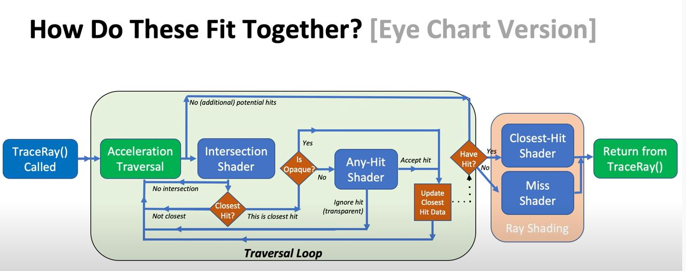

  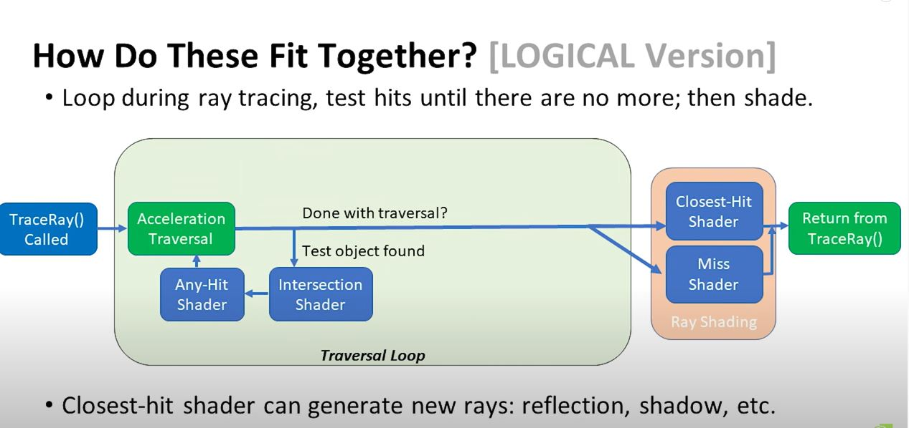

### Any Hits

  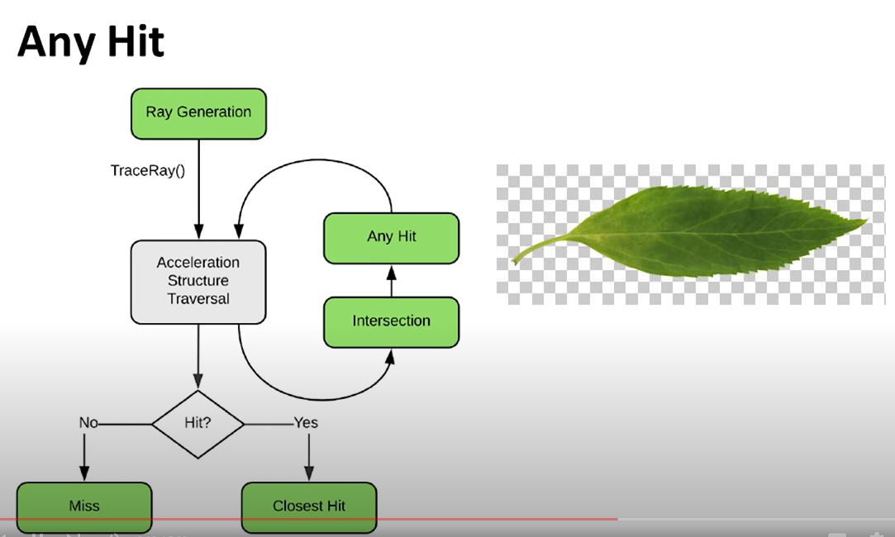

### Ray Tracing Effects
This can be done as simply, use hard shadow and soft shadow.
Instead of looking directly on the light, we're going to have the light that bounces around. This is called as following.
1. Interreflection
2. Indirect Lighting
3. Color Bleeding
4. Global Illumination

Glossy Reflections?

### Ambient Occlusion

  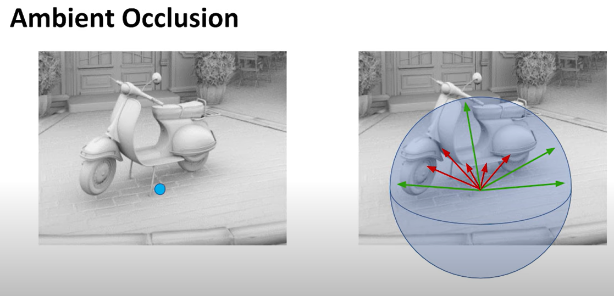

- Physically plausible.
- There's no particular light source in the scene, the little burst of rays were from every location in the scene, trying to see if things 
are in crevices or could be occluded by other objects.

### The Rendering Equation

  

  

1. The outgoing light : Given a point in giving an outgoing direction, what do i see. In other words, I'm looking in a direction at some point what light is coming from that point.
2. The emitted light  : Given a point in giving an outgoing direction, what light is coming from that point.
3. The incoming light : Given a point and given some direction, what do I see in that direction and what light is coming from that direction.
4. The material       : Given an incoming in and outgoing direction, what light goes in the outgoing direction. In other words, for example, like a mirror will be very reflective in one direction. So incoming and the outgoing directions are closely related, but other surfaces many incoming directions will give a different term and different amount of light bounding off the surface.
5. The lambert        : The incoming direction times the normal.

### Lambert's Cosine Law

  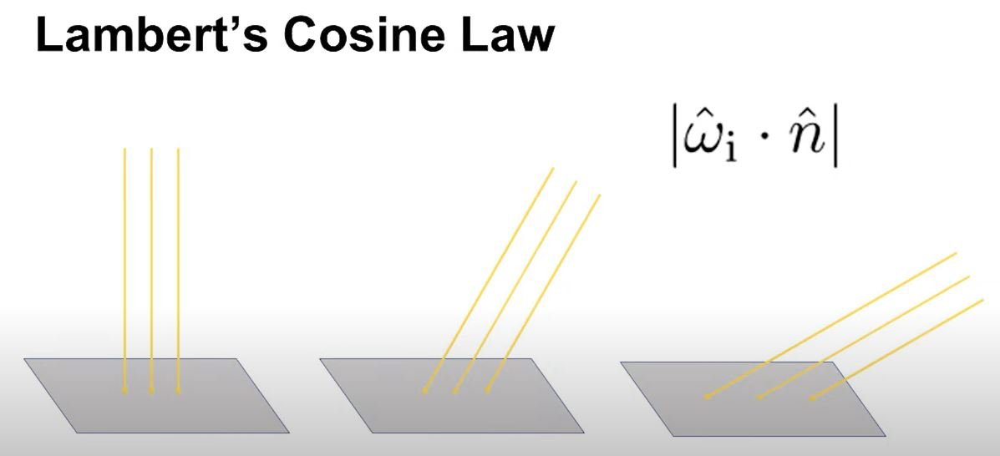

  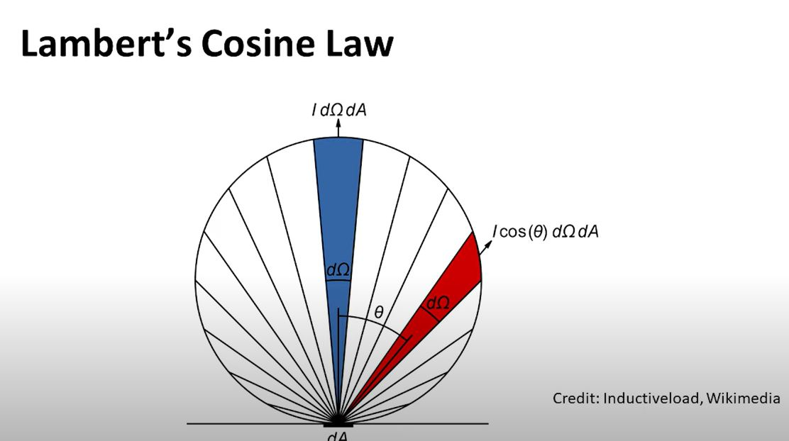

### Pure Path Tracing

  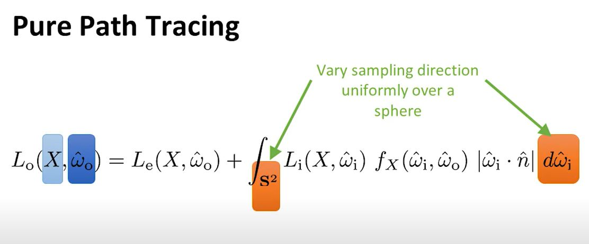

 
All we're going to sum up the light in all directions and that's what's going to go towards to the eye.
We shoot a ray and then we shoot another ray off that surface in some other direction.

  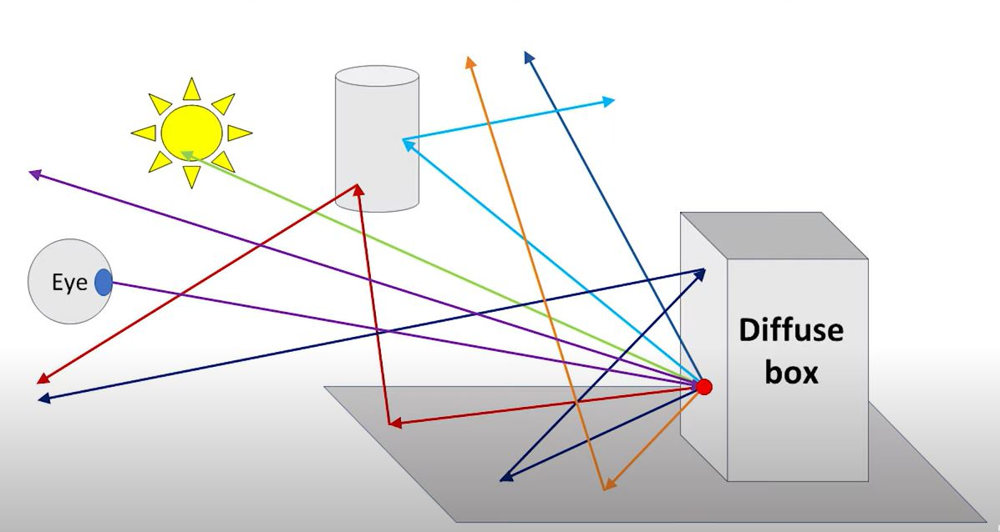

### Importance Sampling

  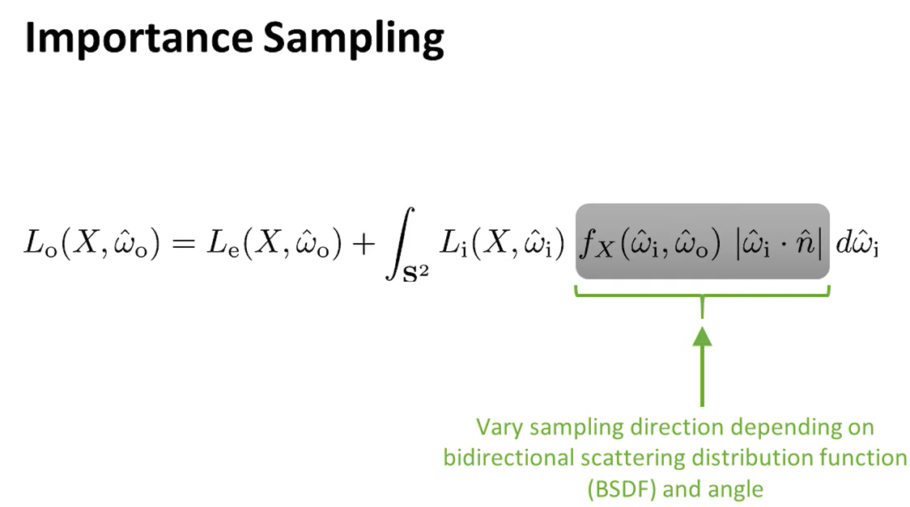

As shown in the above, from the eye the light bounces off in all different direction. This means that the ray-tracing algorithm itself is recursive equation.
This could still be expensive. Why?

### Multiple Importance Sampling (MIS)

  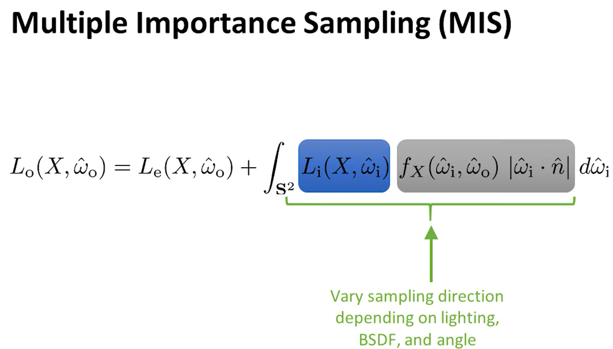

We will vary by the material but we also want to vary using the light direction, so if we know that there's an important light source in the room or if we know that there's
the sun's out there, then we add that as an important place to shoot rays. Instead of shooting the ray randomly, we want to shoot some rays towars taht light.

### Denoising for Ray Tracing

### Ray Sorting

### Cool thing about Ray Tracing
1. Depth of Field --> Background Blur, Foreground Blur, Motion Blur, Atmospheric Effects, Caustics.

### Other References
[Disney's Practical Guid to Path Tracing](https://www.youtube.com/watch?v=frLwRLS_ZR0&ab_channel=WaltDisneyAnimationStudios)