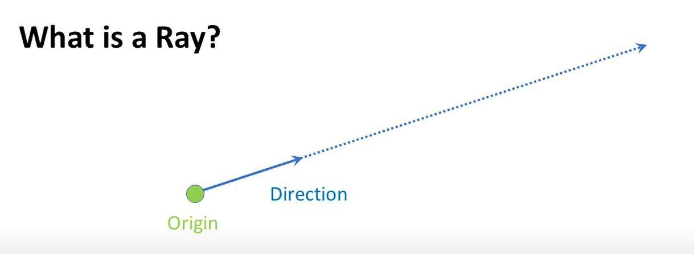

## What is Ray Tracing

In order to define the ray tracing, we need to define what is 'Ray'.
The `Ray` is defined by two things, it has origin in some point in space (xyz) and a direction.

`Ray Castin` is taking the idea of

