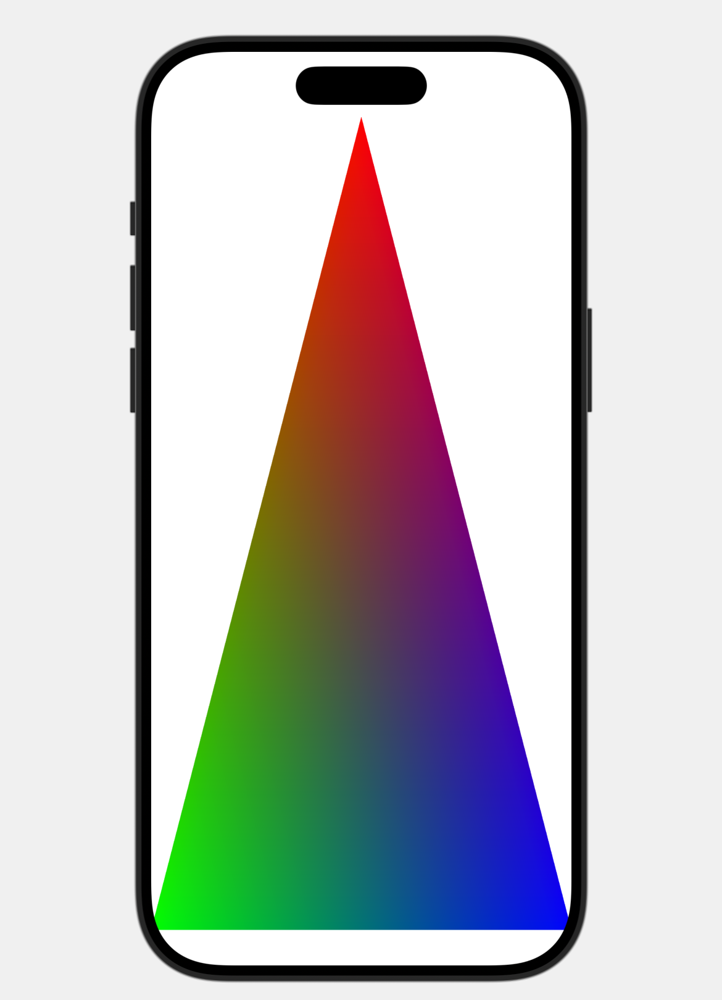

### Draw Triangle
* Written in SwiftUIKit. IOS. Other details are not written for simplicity.

1. Create `MTKDevice`, which represent the GPU device and `CommandQueue` for passing the command
2. In every frame in `draw` in `Renderer.swift`, create commandBuffer and descriptor(`what to do`), then encode this commandBuffer to commandEncoder.
3. Then we tell what PipelineState is by using `MTLRenderPipelineDescriptor` in which, we pass where the vertex shader and pixel shader by using `lib?.makeFunction(name: )` (warning: name must be same as it defined in .metal file).
4. Set those pipelinestate for encoder, then we set the vertexbuffer (how many vertex) and the primitive (shape: how these are going to be shaped depending on MTLPrimitiveType)

```swift
public enum MTLPrimitiveType : UInt, @unchecked Sendable {
    case point = 0
    case line = 1
    case lineStrip = 2
    case triangle = 3
    case triangleStrip = 4
} 
```

5. then we finish encoding and send it to GPU

### Shader
1. The vertex data from CPU is written in `definition.h`
2. For Vertex Data, it takes the data below, R is up, G is left-bottom corner, B is right-bottom corner.

```swift
vertices = [
            Vertex(position: [0, 1], color: [1, 0, 0, 1]),
            Vertex(position: [-1, -1], color: [0, 1, 0, 1]),
            Vertex(position: [1, -1], color: [0, 0, 1, 1])]
```

3. Within the fragment(pixel) shader from vertex shader, return those color to draw on the screen. 

### Result on Preview


### Result on IPad


### Reference