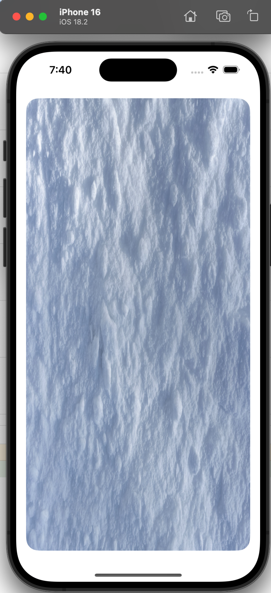

### Texture Rendering

### Key Word: Sampler States
* MTLSamplerDescriptor
* Filtering Mode - Linear & Nearest
* Mipmap levels
* Adressing Mode - Clamp & Repeat (for edge of the texture)
---

### Note 
* You can simply send the texture and textureSampler to the fragment shader by using `SetFragmentTexture` and `SetFragmentSamplerState`. Then switch the parameters as `texture2d<float> texture [[texture(0)]]` and `sampler sampler2d [[sampler(0)]]` in the fragment shader.

* Please look at the `texturedFragmentShader` in `Shader.metal` file.

### Input
* input file is located in ./Texture/Image/snow.jpg

### Output

