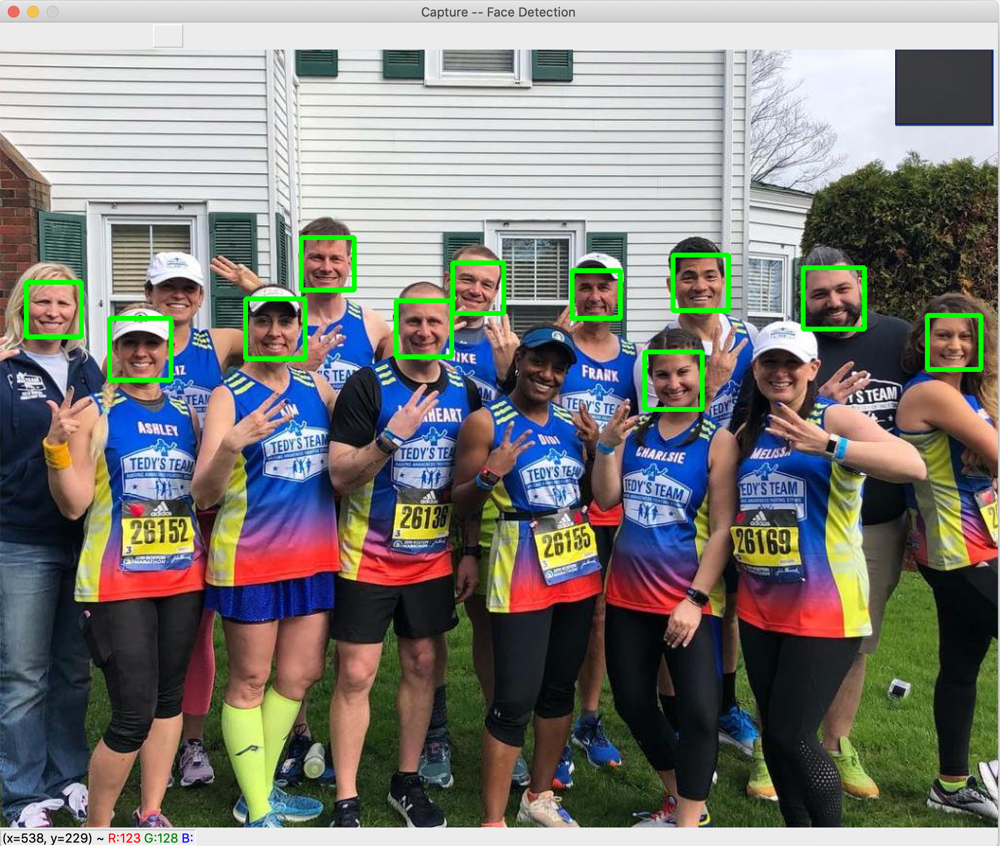

## This is Haar-cascade Detection for face and eye.

  

## The result image for using Haar-cascade classifier

  

### The feature of using Haar-cascade classifier is following:
1. Light and Fast
2. The performace is very low depending on the size of the image.
   * The performace gets low. For example, the people who were wearing the hat won't be able to be detected
   * Since the size of the face is so small, it doesn't detect the eyes at all.
